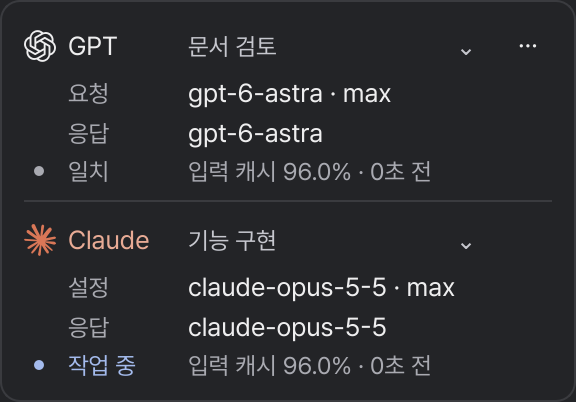

# Pawline

Codex와 Claude Code의 작업·모델·캐시 사용량을 보여주는 데스크톱 도구입니다.

[Windows 다운로드](https://github.com/spac0301/pawline/releases/tag/v0.2.4) · [Linux 설치](INSTALL.md) · [문서](docs/architecture.md)

예시 데이터로 렌더링한 화면

## 사용

**Windows** — 설치 EXE 또는 포터블 ZIP을 받습니다. Python 설치는 필요하지 않습니다. [설치 안내](WINDOWS.md)

**Linux** — Python·GTK 환경에서 실행합니다. [설치 안내](INSTALL.md)

펫은 [Fluff · Sejal R.](https://petdex.dev/pets/fluff) 원본 페이지에서 별도로 받습니다. 그림은 배포 파일에 포함하지 않습니다.

## 기능

- 현재 작업과 진행 상태
- 요청한 모델과 관측된 응답 모델
- 최근 입력의 캐시 적중률과 기록 시각

로컬 기록을 읽으며, 상태 확인을 위한 모델 호출이나 채팅 메시지를 만들지 않습니다.
응답 모델 관측은 [별도 연결](WINDOWS.md#응답-모델-관측-연결)이 필요합니다.

## 문서

[캐시 표시](docs/usage.md) · [보안](SECURITY.md) · [검증 범위](VERIFICATION.md) · [변경 기록](CHANGELOG.md) · [문제 신고](https://github.com/spac0301/pawline/issues)

## 라이선스

[MIT](LICENSE). 외부 코드·폰트·로고·런타임의 조건은 [출처와 고지](THIRD_PARTY_NOTICES.md)를 따릅니다.
OpenAI·Anthropic의 공식 제품은 아닙니다.
