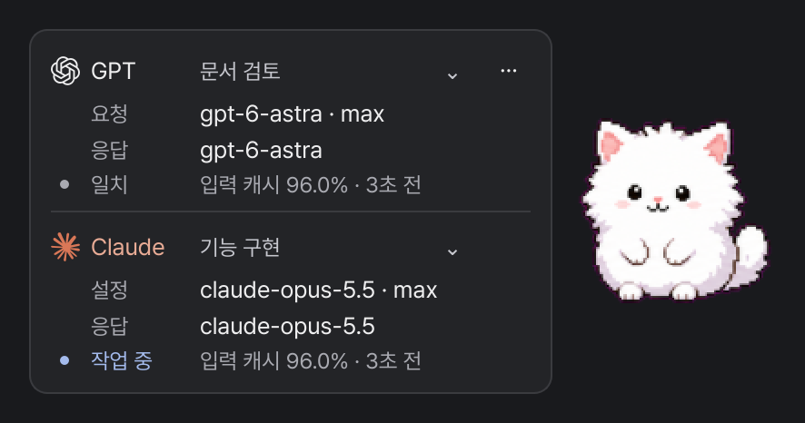

# Pawline

Codex와 Claude Code의 작업 상태, 요청·응답 모델, 입력 캐시 사용량을 펫 옆에서 확인하는 데스크톱 도구입니다.

사용 예시 · 펫: <a href="https://petdex.dev/pets/fluff">Fluff — Sejal R.</a>

## 다운로드

**[Windows · 설치 EXE](https://github.com/spac0301/pawline/releases/download/v0.2.6/Pawline-Setup-0.2.6-x64.exe)** — Python 설치 없이 사용합니다. [설치 안내](WINDOWS.md)

**[Linux · ZIP](https://github.com/spac0301/pawline/releases/download/v0.2.6/pawline-0.2.6-source.zip)** — Python·GTK3 환경에서 실행합니다. [설치 안내](INSTALL.md)

## 시작하기

1. 사용 환경에 맞는 파일을 받아 위 설치 안내에 따라 설치합니다.
2. [Fluff 원본 페이지](https://petdex.dev/pets/fluff)에서 펫을 받습니다. `pet.json`과 `spritesheet.webp`를 사용자 홈의 `.codex/pets/fluff` 폴더에 넣습니다.
3. Pawline을 실행하면 펫과 정보창을 사용할 수 있습니다.

펫에 마우스를 올리거나 클릭하면 정보창을 볼 수 있습니다. 긴 제목과 잘린 상태 문구는 마우스를 올렸을 때 펼쳐집니다.
실제 응답 모델을 관측하는 기능은 추가 연결이 필요합니다. [Windows](WINDOWS.md#응답-모델-관측-연결) · [Linux](INSTALL.md#응답-모델-관측-연결)

## 안내

[표시되는 정보](docs/usage.md) · [보안과 자료 경로](SECURITY.md) · [문제 신고](https://github.com/spac0301/pawline/issues)

프로그램 코드는 [MIT](LICENSE)로 제공됩니다. 펫 설치 파일은 원본 페이지에서 별도로 받으며, 사용 화면에 등장하는 펫의 권리는 원제작자에게 있습니다. [출처와 라이선스](THIRD_PARTY_NOTICES.md)

개발 문서와 다른 다운로드

[포터블 Windows ZIP](https://github.com/spac0301/pawline/releases/download/v0.2.6/pawline-0.2.6-windows-x64.zip) · [구조](docs/architecture.md) · [변경 기록](CHANGELOG.md) · [검증 범위](VERIFICATION.md)

